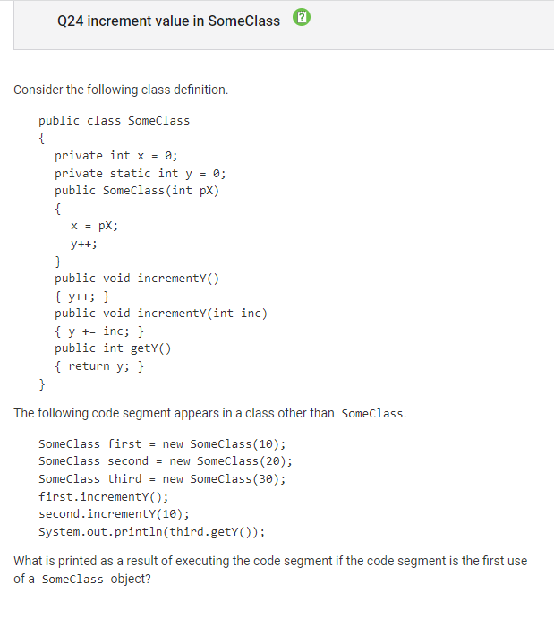

Question 6:

Concept: Casting/division using casting

Correct Answer: A (I only)

A is correct because the (double) cast applies to 2, which makes the division 2/4 evaluate to 0.5

II and III are incorrect because the (double) cast does not apply to 2 /4 until after they are divided as integers and it is truncated. This is because of the added (). It only casts the double after performing 2 / 4 + 3 as integers.

Question 12:

Concept: equals(), ==, != functions 

Correct Answer: B (II only)

B is correct. The missing condition is essentially trying to evaluate 
when borrow is equal to null. If no Person object is assigned to borrower, then I and III will throw an error under the println statement.
Comparatively, II makes sure that borrower has a reference to an object, which is necessary for the method call in the println statement

Question 13:

Concept: DeMorgan's Laws

Correct Answer: E !a || !b || c

E is correct. !(a && b) is equivalent to !a || !b, so in total this is equivalent to !a || !b || c

Question 16:

Concept: Recursion 

Correct Answer: B

The recursive function call is before the for loop that prints the stars, so it will recursively call stars(5), then stars(4), then stars(3) until stars(1).
At stars(1) the function returns without entering the for loop.

But then the function goes to stars(2), prints two stars, then stars(3) and prints 3 stars, etc.

Question 19:

Concept: nested for loops accessing 2D array

Correct Answer: D, 26

The first element of each row is doubled, so the 2d array values
Then x adds all the values in the array, so it becomes 2+2+3+8+5+6=26

Question 21:

Concept: nested arrays

Correct Answer: D, {"of", "of", "of", "spring"}

The for loop essentially assigns the element in arr with the shortest length from its current position to the rest of the elements in the array.

"of" is the shortest element, so the first 3 elements of result are of.
When it gets to the last elements, "spring", there are no other values to consider (since it is the last value of the array) and thus result[3] is spring

Question 22

Concept: Nested arrays

Correct Answer: A, 4

at the position "last" the array is changed to "day" and "of" (executed twice); when j is at value 1, "day" is updated to "of" and when j is at 4, school is updated to "year"

Question 24:

Concept: static keyword

Correct Answer: E, 14

The variable y is declared as a static variable, so all objects of the class will increment y and share the value of y

y increments for each instantiation of the object (occurs 3 times for first, second, third). It also increments again for first.incremenetY(); and 10 times for second.incrementY(10) for a total of 14.

Question 28:

Concept:substring method

Correct Answer: B, "si the so"

the function abMethod(String a, String b) essentially removes all instances of b, or in this case "ng" from String a. As a result, the method returns "si the so" because it removes the "ng"

Question 32: 

Concept: declaration of classes, inheritance, override methods

Correct Answer: B, "B"

Since obj is instantiated with the ClassB constructor, the object is a ClassB object. 
When obj.showValue() is run, it will access the showValue method in the superclass. Since the getValue method is defined in ClassB, though, it will access getValue in ClassB and print "B"

Question 34:

Concept: ArrayList, while loops

Correct Answer: E, The method skips some elements of numList during the traversal

when the function finds a num that is a multiple of key, it will remove it from numList, and then increment i. However, removing the value
causes all the subsequent values to shift to the left, and when i is incremeneted, this will result in some values not being considered. 

Question 39: 

Concept: string methods 

Correct Answer: recurmethod("edcba")

For the substring method, if str.substring(0,1).compareTo(str.substring(1,2)) > 0, then 
this means the character at position 0 is greater than position 1. It is greater if it is lower in the alphabet. Therefore, calling 
recurMethod("edbca") will be able to recursively call the function until the length of the string edcba is <=1 and the function returns true

Question 40:

Concept: creating objects 

Correct Answer: A, the statement in line 3 will cause a compiler error because the message method for obj1 cannot be found

If the message method from class A is removed, then obj1 (which is declared as an object of type A), will have a compile error because there is no emssage method in class A anymore.
