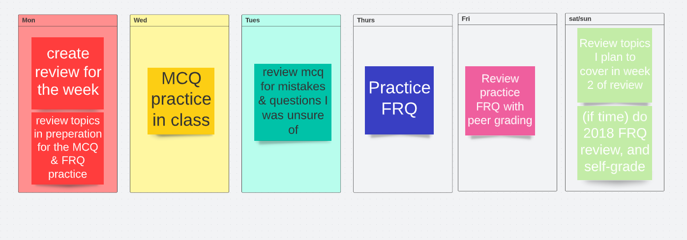
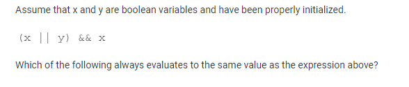
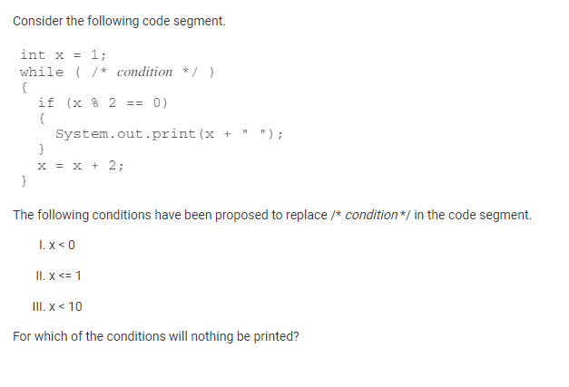
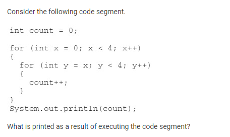
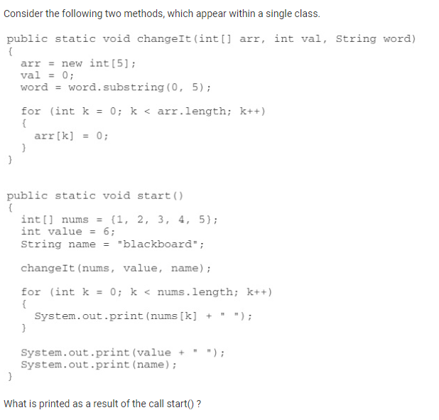
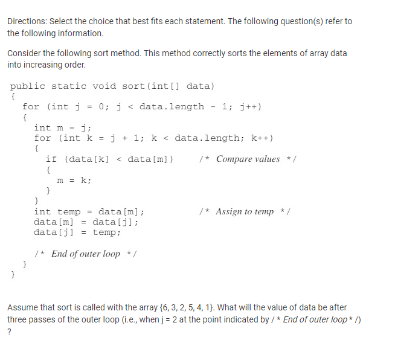
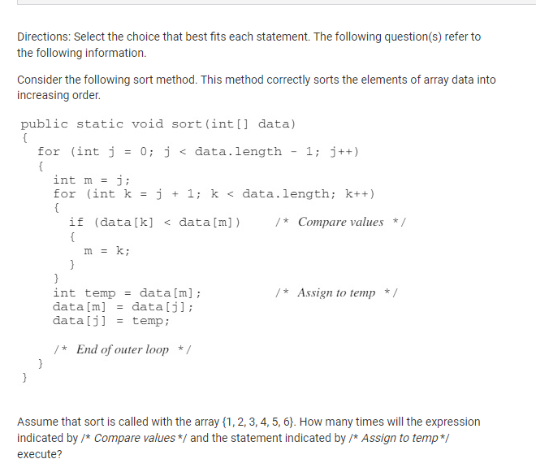
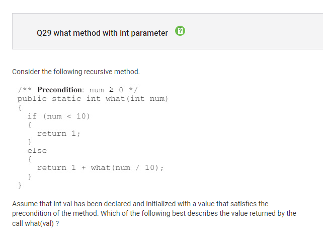
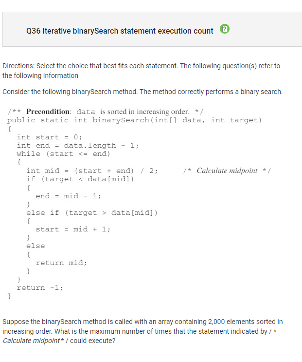
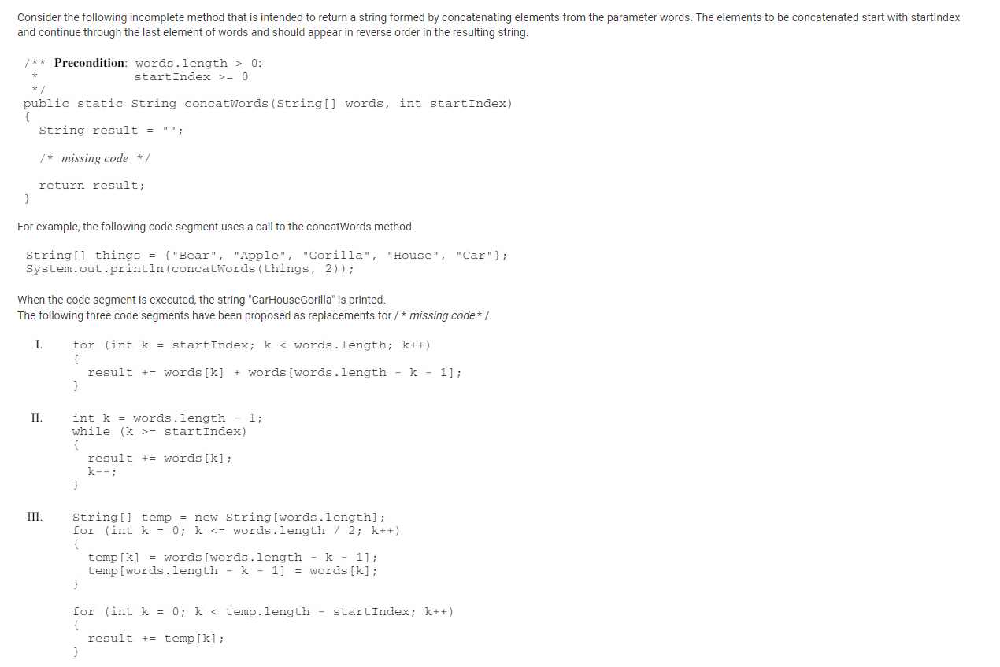

# What I am doing week 1 to prepare for the AP Test

Review AP CSA units, including previous college Board notes created
### [link](https://docs.google.com/document/d/1rQ8z91C-Mmy7DM4ozQFGF6tpygs-JecdTkGqwuVlw7Y/edit)

Review the covered topics in the AP Exam
### [link](https://apcentral.collegeboard.org/pdf/ap-computer-science-a-course-a-glance.pdf?course=ap-computer-science-a)

Review THESE topics this week BEFORE MCQ & FRQ practice: 
* Writing and creating classes
* ArrayLists and the special functions they have
* Recursive functions
* Inheritance: parent & child classes, super() keyword
* When to use specific keywords for classes: private/public, static, void, when a return statement is necessary

Finish MCQ on Tuesday, on Wednesday do _corrections_ for the MCQ

Thursday do a complete FRQ & peer review FRQ

## Timebox

## GOALS:
* Reach at least 30 on each practice MCQ. Each week's practice MCQ should have a better score by of at least 3 (so next practice MCQ get at least 33)
* Understand all concepts on the test after completing test corrections for MCQ
* Get at least a 4 on the AP Exam cumulative after adding both MCQ and FRQ scores

### skeleton preparation for  week 2:

Review THESE topics BEFORE MCQ & FRQ
* Writing and creating classes
* Arrays, what questions are asked on Arrays
* 2D Arrays (and nested for loops)
* enhanced for loops
* sorts

Do 1 MCQ and 1 FRQ IN CLASS

Do one additional FRQ practice _outside of class_, specifically 2017 frq: [link](https://apcentral.collegeboard.org/pdf/ap-computer-science-a-frq-2017.pdf)
and 2018 MCQ practice exam: [link](https://www.apcsaexam.org/mcpractice.html)

## Week 1 MCQ Test Corrections
Question 5: 

Concept: boolean expressions & deMorgan's law

Correct answer: A
* This answer is correct because x is always true to (x || y) && x --> (x or y) && x --> (anything) && x --> x

Question 19: 

Concept: loops 

Correct answer: E, I, II, and III
* This answer is correct because 
* For II and III: x is initially set to 1, and incremented by 2, so x is always odd. Therefore, x % 2 will never be 0, since x is always odd. 
* For I, if x < 0 then nothing will happen since the condition is false

Question 25:

Concept: nested for loops

Correct Answer: 10
* The mistake I made in choosing 16 was not noticing that in the inner loop, y=x. This means for each iteration of the outer loop, y is not repeating 4 times, therefore it cannot be 16.
* Instead, the first iteration of the outer loop the count increases by 4, then for the 2nd iteration of the outer loop count increases by 3, then 2, then 1. Therefore, count is 10

**Question 26:**

Concept: writing methods

Correct Answer: E, 1 2 3 4 5 6 blackboard
NEED TO FINISH

Question 27: 

Concept: Iterating through and sorting arrays

Correct Answer: B {1, 2, 3, 5, 4, 6}
* This is essentially a selection sort 
* On the third pass of the outer loop, the first 3 values of the array will be sorted (correctly in the 1, 2, 3 order)
* On the first pass of outer loop, 1 is swapped with 6 so now 6 is on the end
* on the second pass of outer loop, 2 is swapped with 3 
* on the 3rd pass of outer loop, everything stays where it is
* final array on 3rd pass is {1, 2, 3, 5, 4, 6}

**Question 28:** 

Concept: iterating & sorting arrays

Correct Answer: Compare values 15, assign to temp 5
NEED TO FINISH

Question 29:

Concept: Recursion

Correct Answer: A, the number of digits in the decimal representation of val is returned
* This is kind of obvious and I should've been more careful when looking at this answer
* essentially, what the code does is continue dividing the number by 10, returning 1 each time, in order to get the total number of digits in num

**Question 36:**

Concept: Recursive sorting

Correct Answer: 11
* 11 is correct because 
* NEED TO FINISH

**Question 37:** 

Concept: arrays

Correct Answer: E II and III
* II is correct (I originally already knew this) because it starts from the end of the array words, and concatenates the other values in words until the startIndex going backwards (done correctly)
* III is also correct because it first swaps the order of all the values in words, and then concatenates so it successfully adds all the words going in a backwards order